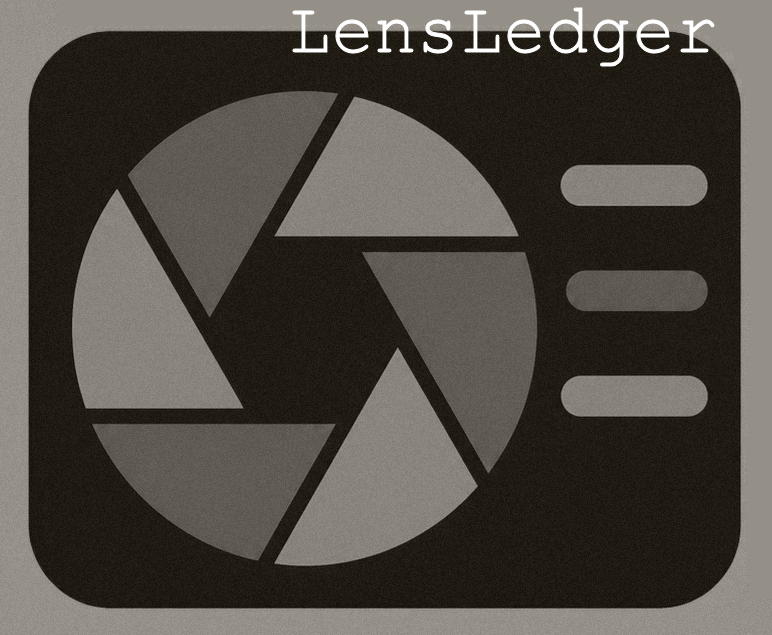

<p align="center">
  
</p>

<h3 align="center">Your photos, understood.</h3>

<p align="center">
  <a href="https://github.com/WeirDave/LensLedger/releases/latest"></a>
  <a href="https://github.com/WeirDave/LensLedger/actions/workflows/tests.yml"></a>
  
  
  
</p>

---

## What is LensLedger?

LensLedger is a local-first photo and video index, search, and metadata review
tool. Point it at a library and it builds a private SQLite catalog without
uploading your media or changing the originals. Browse by date, search across
visible subjects and event context, review people suggestions, inspect embedded
metadata, and explicitly publish approved descriptions, keywords, or people to
individual JPEG files.

The guided first run suggests likely photo folders and scans the selected
library while showing live progress. When it finishes, LensLedger reports the
number of images, videos, RAW originals, metadata-ready files, and cloud-only
placeholders it found. The scanner is incremental: unchanged files are skipped,
new files are added, and missing files leave the index. Dropbox and other
Windows cloud placeholders can be inventoried without forcing a download;
deeper metadata analysis waits until those files are locally available.

## Highlights

- Read-only library discovery and incremental scanning
- Guided first-library setup with live progress, pause, resume, and an inventory report
- Read-only local Photo Map built from embedded GPS coordinates
- Remembered library switching and suggested Windows photo locations
- Separate SQLite index for every selected photo library
- Camera RAW inventory with an explicit preview-unavailable state
- Full-text search across paths, dates, subjects, tags, people, and OCR
- Optional local meaning search across image content using an opt-in OpenCLIP model
- Staged edits that remain in LensLedger until explicitly published
- Field-by-field metadata preview before JPEG writes
- Timestamped safety copies and decoded-pixel verification after publication
- Reversible review bin and people-review history
- Local face profiles that never confirm identities automatically
- Exact face boxes during People review when coordinates are available
- Merge duplicate People names while retaining the alternate spellings for search
- Per-user data storage, separate from application source and photo folders
- Library health, verified backups, and resumable local OCR from the viewer
- Verified, user-approved updates with clean replacement and rollback copies

## Quick start

### Windows release

1. Download `LensLedger-vX.Y.Z.zip` from the [latest release](https://github.com/WeirDave/LensLedger/releases/latest).
2. Extract the ZIP to a temporary folder.
3. Install [Python 3.11 or newer](https://www.python.org/downloads/) and select **Add Python to PATH** during setup.
4. Double-click **Install LensLedger.cmd**. LensLedger installs into your private
   per-user Programs folder and starts automatically. The extracted ZIP can then
   be deleted.
5. On first launch it installs the small Python requirements if they are not
   already present.
6. Choose the photo folder you want to inventory and select **Build my library**.
7. Review the scan report, then select **Open my library**.

LensLedger opens a localhost-only viewer at `http://127.0.0.1:5309`. Keep the
terminal window open while using the application.

### Updates and rollback

LensLedger checks for a newer GitHub release when the viewer opens and at most
once every six hours while it remains in use. It only shows a notification; an
update is never installed until you open **Check for updates** and approve it.

The updater downloads the release through GitHub's release API, verifies the
asset against GitHub's SHA-256 digest, rejects unsafe ZIP paths, validates the
required application files and version, then stages the release separately.
It never replaces a Git checkout or an existing unmanaged folder. Managed
installations are replaced as a complete directory, and the prior version is
kept beside the installation as `LensLedger.previous-...` for rollback.

The managed application is installed under:

```text
%LOCALAPPDATA%\Programs\LensLedger\
```

Runtime data remains separately stored under `%LOCALAPPDATA%\LensLedger\` and
is not part of application replacement. Private repositories require an
existing GitHub CLI login (`gh auth login`) or a `LENSLEDGER_GITHUB_TOKEN`.

To migrate a pre-v0.16 copy whose database still lives beside the application,
pass that old folder to the installer:

```powershell
& '.\Install LensLedger.cmd' 'C:\path\to\old\LensLedger'
```

The installer creates a consistent SQLite backup in the new data location,
upgrades and verifies it, registers the detected photo-library root, and leaves
the entire legacy installation unchanged.

### Run from source

```powershell
git clone https://github.com/WeirDave/LensLedger.git
cd LensLedger
python -m pip install -r requirements.txt
python photo_search.py
```

### Optional legacy face-box recovery

New face-index imports may include normalized face rectangles directly. Older
recovered catalogs retained their embeddings but not those rectangles. To
rebuild them locally with a compatible InsightFace model:

```powershell
python -m pip install -r requirements-face.txt
python face_locations.py --db "C:\path\to\library.sqlite3" --library "C:\path\to\photos"
```

Only a strong, unambiguous embedding match is saved. Photos and vectors remain
on the computer. LensLedger does not bundle or redistribute a pretrained face
model; review the model provider's separate usage terms before downloading one.

## First run and data location

The repository and release contain no database and no personal photo data.
LensLedger creates runtime files under:

```text
%LOCALAPPDATA%\LensLedger\
  library-state.json
  Libraries\
  Metadata Backups\
  Database Backups\
  Review Bin\
  Face Data\
```

Each selected library receives its own database, and LensLedger remembers prior
libraries so they can be reopened from the menu. Photos remain in their original
folders. Set `LENSLEDGER_DATA_DIR` before launch to use a different runtime-data
directory.

## Database tools

Create an empty database, inspect it, verify it, back it up, migrate it, or
rebuild full-text search:

```powershell
python database_tools.py init
python database_tools.py status
python database_tools.py verify
python database_tools.py backup
python database_tools.py migrate
python database_tools.py rebuild-search
```

Use `--db C:\path\to\library.sqlite3` before the command to target a specific
database. Backups use SQLite's online backup API and are integrity-checked.

The indexer also remains available directly:

```powershell
python photo_index.py scan "C:\Users\you\Pictures"
python photo_index.py stats
python photo_index.py query "beach AND sunset"
python photo_index.py ocr --since 2025-01-01 --workers 4
```

## Optional local meaning search

The standard LensLedger installation stays small. Natural-language image search
is an explicit opt-in because its local model and machine-learning runtime are
large. To enable it:

```powershell
python -m pip install -r requirements-semantic.txt
python semantic_index.py --db C:\path\to\library.sqlite3 build
```

The same incremental, pausable build is available from **Library health & OCR**
after the optional packages are installed. Select **Meaning (optional)** as the
search scope and describe a scene, object, or idea. Image vectors, search text,
and results remain on the computer. The first build may download the selected
OpenCLIP model weights from their upstream host.

## Safety and privacy

- The server binds only to `127.0.0.1`.
- Scanning and database edits do not alter media files.
- Metadata publication is explicit and limited to supported JPEG files.
- Every publication creates a safety copy and verifies that decoded pixels are unchanged.
- Face matching and OCR run locally; no photo is uploaded by LensLedger.
- Suggested identities remain review-only until a person confirms them.

## Development

The localhost server is intentionally thin around focused service modules:
`photo_index.py` owns catalog and schema work, `metadata_reader.py` owns embedded
metadata and pixel-integrity checks, `library_config.py` owns per-library state,
and `semantic_index.py` owns the optional meaning index. This keeps private file
operations independently testable from the UI.

```powershell
python -m unittest discover -s tests -v
python -m compileall -q .
```

Release tags matching `v*` run the Windows test suite and publish a versioned
ZIP through GitHub Actions. Release notes live under `docs/releases/`.

## Current scope

LensLedger indexes common image and video formats, common camera RAW originals,
file and folder dates, existing XMP keywords, curated tags, Windows OCR, and
locally reviewed people. RAW files are inventoried and searchable, but the
browser viewer does not decode them yet. Audio files such as WAV are outside the
photo-library inventory.
Semantic image embeddings run as an optional independent worker so models can
evolve without rewriting photos or rebuilding the basic inventory. Richer
duplicate detection remains planned.

## License

LensLedger is available under the [MIT License](LICENSE). Bundled ExifTool files
retain their upstream license; see [third-party notices](THIRD_PARTY_NOTICES.md).
